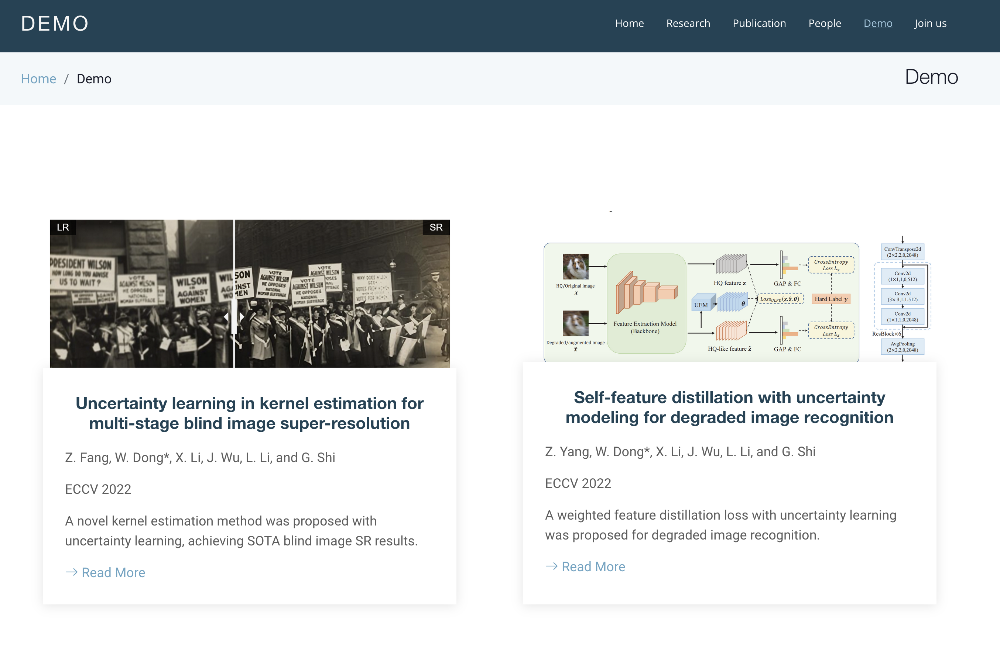
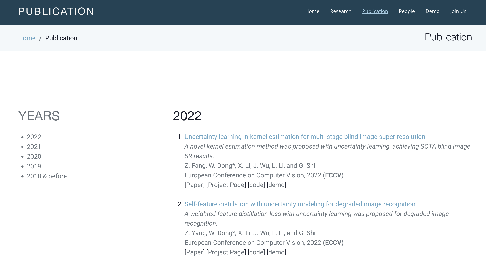
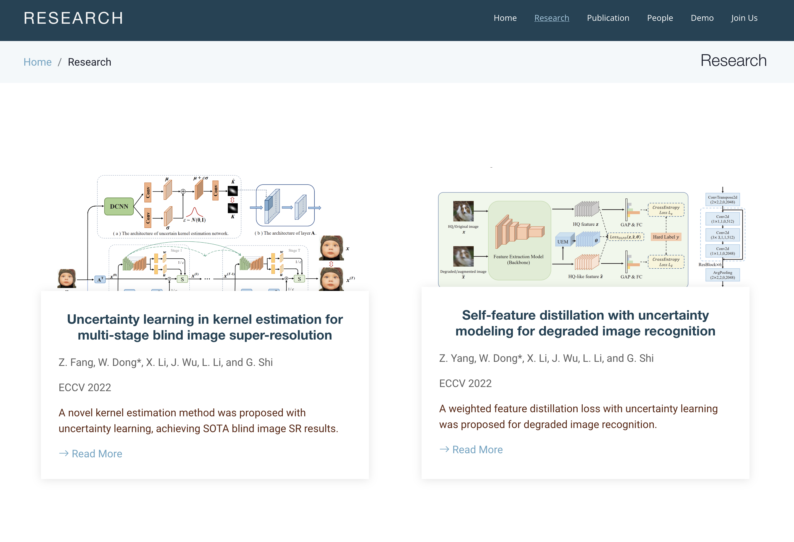
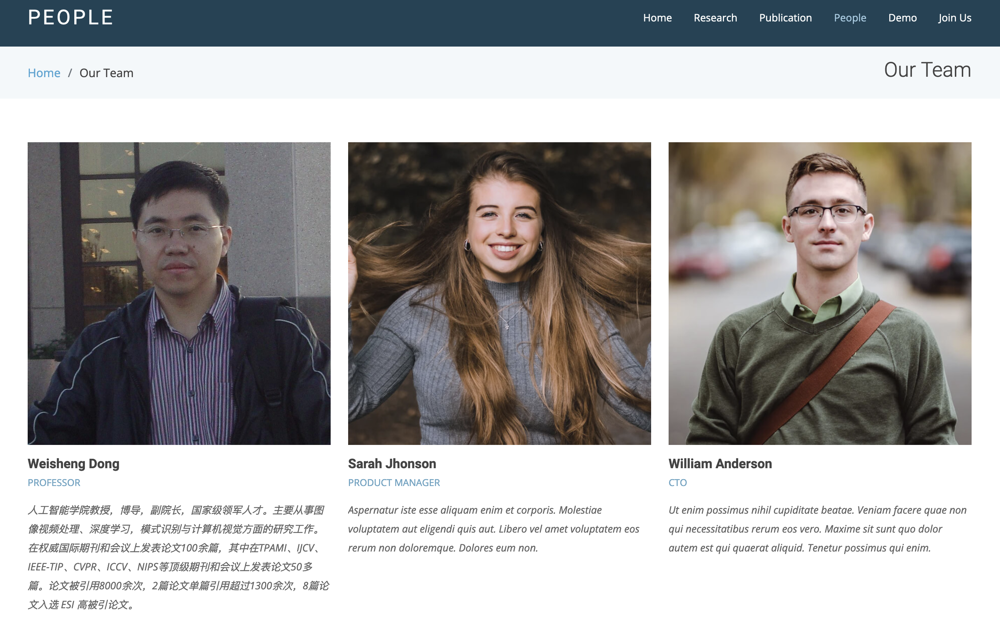

<!-- - [VRL-Lab's Structure](#vrl-lab-s-structure)
  * [前端](#--)
    + [首先是各个文件夹](#--------)
    + [下面是每个有用的html](#--------html)
    + [后续维护](#----)
      - [index.html和index_zh.html的论文简介](#indexhtml-index-zhhtml-----)
      - [reaserch.html和demo.html的论文卡片添加](#reaserchhtml-demohtml-------)
      - [publication.html的论文添加](#publicationhtml-----)
      - [team.html的成员添加](#teamhtml-----)
  * [后端](#--)
    + [前端展示界面](#------)
    + [后端神经网络演示代码](#----------) -->
# VRL-Lab's Structure
这里是VRL-Lab实验室主页的相关源代码，此readme主要方便后续维护者的工作。

---

首先这个东西分两个部分
- 前端（阿里云公网服务器，IP为 106.14.213.79）
- 后端（在董老师办公室的3090服务器一台，系统为Ubuntu 20.04）

主要可以实现：
- 实验室主页 (静态html)
    > 纯前端运行
- 部分同学的工作成果展示 (python的streamlit库 + 内网穿透)
    > 前端 + 后端配合
---

## 前端
整个工程包的路径是 `/var/www/html_dws`，里面有所有的html，css文件

html文件使用`nignx`反向代理，具体步骤见[这篇知乎](https://zhuanlan.zhihu.com/p/615506680)的前半部分

### 首先是各个文件夹

- .idea、.vscode、forms没有用到过，可忽略

- assets
    - css: 里面含有css样式，主要用到的是 `assets/css/style.css` 和 `assets/css/theme.css` 两个文件
    - img: 存放非project page类(见下面的project部分)的页面包含的各式各样的图片，`team`文件夹用来存放`team.html`中人员介绍的头像图，`readme`文件夹用来存放readme的插图，其他子文件夹的图片暂未用到，以及其他直接存放在`assets/img`路径下的图片并未进行分类，后续可根据管理需要进行重构
    - js、scss、vendor三个文件夹暂未使用，但先保留

- project: 存放同学们已发表的论文，一个文件夹为一篇论文的介绍
    - index.html: 每篇论文的静态展示(project page)，含摘要、实验结果、网络图等
    - 其他文件夹：主要存放相关图片，可根据每篇论文的实际需求自定义建立不同的子文件夹

### 下面是每个有用的html
- [contact.html](http://106.14.213.79/contact.html): 招生简章

    还没弄好，弄好了再截图

- [demo.html](http://106.14.213.79/demo.html): 卡片集合，点开卡片会跳转到相应论文的实际运行界面(streamlit) <a href="#research_and_demo">后续维护看这里</a>

    

- [index_zh.html](http://106.14.213.79/index_zh.html): 实验室概览中文版 <a href="#index_eng_zh">后续维护看这里</a>

    

- [index.html](http://106.14.213.79/index.html): 实验室概览英文版 <a href="#index_eng_zh">后续维护看这里</a>

    

- [publication.html](http://106.14.213.79/publication.html): 以干条的形式列出所有的论文，以年份分类 <a href="#publication">后续维护看这里</a>

    

- [research.html](http://106.14.213.79/research.html): 卡片集合，点开卡片会跳转到相应论文的project page界面 <a href="#research_and_demo">后续维护看这里</a>

    

- [team.html](http://106.14.213.79/team.html): 实验室成员介绍 <a href="#team">后续维护看这里</a>

    

### 后续维护
#### index.html和index_zh.html的论文简介<a id="index_eng_zh">
```HTML
<!-- ECCV_2022_Fang -->
    <div class="row" data-aos="fade-up">
        <div class="col-md-7 pt-4" data-aos="fade-up">
            <h3>论文题目</h3>
            <h5>论文作者</h5>
            <h6>发表的会议/期刊  年份</h6>
            <ul class="faq-list">
                <br>
                <li>
                    <div data-bs-toggle="collapse" class="collapsed question" href="#abstract_xxx_xxx_year"> <h5>Abstract</h5> <i class="bi bi-chevron-down icon-show"></i><i class="bi bi-chevron-up icon-close"></i></div>
                    <div id="abstract_xxx_xxx_year" class="collapse" data-bs-parent=".faq-list">
                        <p>
                            这里写论文摘要
                        </p>
                    </div>                               
                </li>
            </ul>
        </div>
        <div class="col-md-5 pt-4" data-aos="fade-up" style="display: table;">
            
            <li><i class="bi bi-check"></i> <a href="论文的pdf文件地址">Paper</a></li>
            <li><i class="bi bi-check"></i> <a href="论文的GitHub仓库地址（如已开源）">Code</a></li>
            <li><i class="bi bi-check"></i> <a href="论文的演示界面地址（IP + 端口号即可）">Demo</a></li>
        </div>
        <br>
        <br>
    </div>
```

#### research.html和demo.html的论文卡片添加<a id="research_and_demo">
```html
<!--          所有涉及路径的文件，需要放到规定的储存位置-->
<div class="col-md-6 d-flex align-items-stretch" data-aos="fade-up">
    <div class="card">
        <div class="card-img">
            
        </div>

        <div class="card-body">
            <!-- 如果是research.html -->
            <h5 class="card-title"><a href="论文project_page的链接，示例：./project/fzx_eccv2022/index.html">论文题目，示例：Uncertainty learning in kernel estimation for multi-stage blind image super-resolution</a></h5>
            <!-- 如果是demo.html -->
            <h5 class="card-title"><a href="演示界面链接">示例：106.1.1.1:8501</a></h5>
            <p class="card-text">论文作者，示例：Z. Fang, W. Dong*, X. Li, J. Wu, L. Li, and G. Shi </p>
            <p class="card-text">发表于哪一年，哪个会议/期刊，示例：ECCV 2022</p>
            <p class="card-text"><span style="color:#5E2612">一句话概括该论文，示例：A novel kernel estimation method was proposed with uncertainty learning, achieving SOTA blind image SR results.</span></p>
            <div class="Try"><a href="论文project_page的链接，示例：./project/fzx_eccv2022/index.html"><i class="bi bi-arrow-right"></i> Read More</a></div>
        </div>
    </div>
</div>
```

#### publication.html的论文添加<a id="publication">
```html
<li>
    <a href="论文project_page的链接，示例：./project/fzx_eccv2022/index.html">论文题目，示例：Uncertainty learning in kernel estimation for multi-stage blind image super-resolution</a>
    <br />
    <span class="text-600">
    <I>一句话概括该论文，示例：A novel kernel estimation method was proposed with uncertainty learning, achieving SOTA blind image SR results.</I> <br />
    论文作者，示例Z. Fang, W. Dong*, X. Li, J. Wu, L. Li, and G. Shi  <br />
    发表于哪一年，哪个会议/期刊，示例：European Conference on Computer Vision, 2022 <strong>(ECCV)</strong><br />
    </span>
    [<a href="论文pdf的链接，示例：https://www.ecva.net/papers/eccv_2022/papers_ECCV/papers/136780141.pdf" target="_blank"><span class="text-muted">Paper</span></a>]
    [<a href="论文project_page的链接，示例：./project/fzx_eccv2022/index.html" target="_blank"><span class="text-muted">Project Page</span></a>]
    [<a href="论文代码的链接（如已开源），示例：https://github.com/Fangzhenxuan/UncertaintySR" target="_blank"><span class="text-muted">code</span></a>]
    [<a href="论文的演示界面地址（IP + 端口号即可），示例：http://106.1.1.1:8501" target="_blank"><span class="text-muted">demo</span></a>]
</li>
<br />
```


#### team.html的成员添加<a id="team">
```html
<div class="col-lg-4 col-md-6 d-flex align-items-stretch">
    <div class="member">
        <div class="member-img">
            
            <!-- 下面这些注释先行保留，如果有成员有个人主页，可将其取消注释，并放置相应的链接 -->
    <!--                <div class="social">-->
    <!--                  <a href=""><i class="bi bi-twitter"></i></a>-->
    <!--                  <a href=""><i class="bi bi-facebook"></i></a>-->
    <!--                  <a href=""><i class="bi bi-instagram"></i></a>-->
    <!--                  <a href=""><i class="bi bi-linkedin"></i></a>-->
    <!--                </div>-->
        </div>

        <div class="member-info">
            <h4>名字，示例：Weisheng Dong</h4>
            <span>头衔，示例Professor</span>
            <p>简介，示例：人工智能学院教授，博导，副院长，国家级领军人才。主要从事图像视频处理、深度学习，模式识别与计算机视觉方面的研究工作。在权威国际期刊和会议上发表论文100余篇，其中在TPAMI、IJCV、IEEE-TIP、CVPR、ICCV、NIPS等顶级期刊和会议上发表论文50多篇。论文被引用8000余次，2篇论文单篇引用超过1300余次，8篇论文入选 ESI 高被引论文。</p>
        </div>
    </div>
</div>
```
## 后端
主要是用户通过前端展示界面上传图片或视频，将上传内容作为输入，传送至办公室的3090上跑相应神经网络演示代码的前向推理，再将输出结果上传至前端展示界面，可供用户浏览、比较

### 前端展示界面
使用python的[streamlit](https://streamlit.io/)库来搭建，但需要在3090机器上把服务跑起来，然后用frp把本地的页面映射至公网（frp参考[这篇知乎](https://zhuanlan.zhihu.com/p/615506680)的后半部分）

*有些坑还没填，比如如何处理多并发时多个上传内容的存储*

### 后端神经网络演示代码
需要神经网络的前向推理代码

具体来说，需要：

- 自己训练好的权重文件，用于加载

- 如下格式的.py文件

    ```python
    class Net():
        # 你的神经网络代码

    def load_check(model_path):# model_path是权重文件的路径
        our_model = Net() # 初始化网络模型
        our_model.load_state_dict(torch.load(model_path, map_location='cpu')) # 加载权重文件
        return our_model

    def pridict(our_model, input_file): # input_file是照片或视频
        input_file = prepare_input(input_file) # 数据的预处理（需要自己写prepare_input）(无需预处理则不用该函数)

        with torch.no_grad():
            if torch.cuda.is_available():
                our_model = our_model.cuda()
                input_file = input_file.cuda()

            output = our_model(input_file)
            output = output.detach().cpu().numpy().blahblah() # blahblah指的是后续的一系列处理，使其可以转化为cv2格式的图片，便于保存
            cv2.imwrite('save_path', output)

    # 要保证pridict(load_check(model_path), input_file可以成功运行)

    # 如果输入是照片的话，则按照上面的代码来跑就没问题；如果是视频，则需要拆帧软件（比如ffmpeg或其他的python拆帧工具）将其拆分，然后套一个循环来处理视频帧，再将输出结果拼接起来即可
    ```
- 可以让这个代码顺利运行起来的最小的anaconda环境清单（可以理解为上面.py文件最前面所有的import），同时需要标明python，torch和cuda版本，以便适配


Thanks for downloading this template!

Template Name: Moderna
Template URL: https://bootstrapmade.com/free-bootstrap-template-corporate-moderna/
Author: BootstrapMade.com
License: https://bootstrapmade.com/license/
